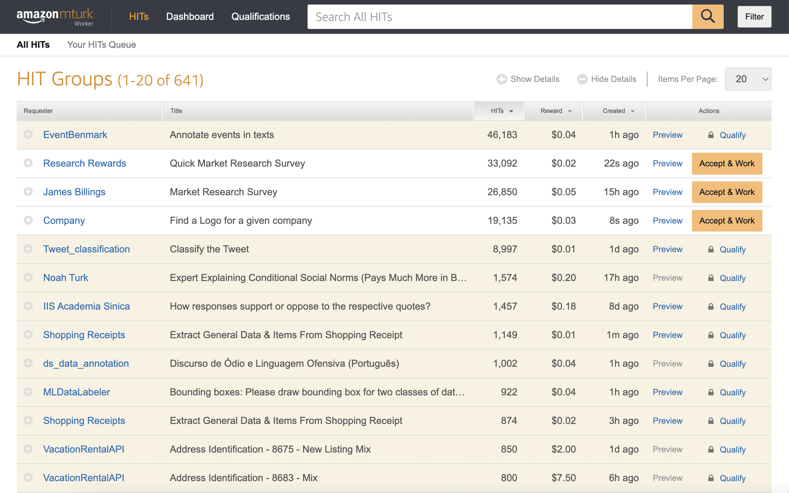

# Where Does Labeled NLP Data Come From?

## Introduction

As you begin to build text classification models, you will typically start with a prepared dataset from the UCI ML Repository or Kaggle. But where did those labeled datasets, and the ones commonly used in industry, actually come from? And what ethical concerns might arise in the process of acquiring them?

## Objectives

You will be able to:

* Explain why NLP datasets are less likely to be labeled automatically
* Define MTurk and HITs in the context of data labeling
* Describe the ethical considerations around paying data labelers
* Describe the ethical considerations around using large datasets scraped from the Internet

## "Ground Truth" in Machine Learning

In order to train and evaluate a supervised machine learning model, you need to have some kind of _label_ for each record. These labels are often referred to as the "ground truth", and the difference between the model's predictions and the ground truth is how the quality of the model is measured.

For some applications of machine learning, the ground truth data points are collected automatically as part of some other process. For example, a business might keep track of customers with active contracts in their [CRM software](https://www.salesforce.com/crm/what-is-crm-infographic/) in order to allocate resources appropriately, and along the way create a dataset that can be used to predict customer churn. Or a government agency might measure atmospheric conditions using various sensors, and along the way create a dataset that can be used to predict forest fires.

For NLP datasets, the question of ground truth is more complicated and almost always requires human intervention. Consider the example of _sentiment analysis_, one of the most popular use cases for NLP classifiers. Sentiment analysis means you are trying to measure a positive, negative, or neutral sentiment in a text sample. There is no equivalent to the CRM software or remote sensors where the sentiment of text is automatically recorded, so where can data scientists find ground truth labels?

The two main approaches for this are paying ***data labelers*** or using ***implicit labels*** scraped from the internet. Both approaches pose ethical challenges.

## Data Labeling

### Data Labeling History: Qualitative Coding

The practice of data labeling can be traced back to the social science practice of [_qualitative coding_](https://en.wikipedia.org/wiki/Coding_(social_sciences)). Qualitative coding typically involves social science researchers poring over "raw" forms of data such as field notes or interview transcripts and applying "codes". These codes are sometimes determined before the analysis begins (also known as "a priori" or "deductive" codes), and are sometimes developed during the analysis (also known as "grounded" or "inductive" codes). Often multiple researchers will apply codes to the same text sample and then use statistical techniques to measure the [inter-rater reliability](https://www.statology.org/inter-rater-reliability/) and ensure that the codes are being applied to the samples in a consistent way.

The purpose of qualitative coding is typically to produce qualitative research for publication in an academic journal or conference. The codes help the researchers to formulate insights and possibly new social science theories, and the underlying text samples frequently appear as examples in the final publication.

### Data Labeling Today: Crowd Workers

As machine learning has expanded to include text classification, the classic qualitative coding approach was seen as too expensive and time-consuming for labeling thousands or millions of text samples. Data scientists ([and social scientists](https://blogs.lse.ac.uk/impactofsocialsciences/2020/12/15/how-to-conduct-valid-social-science-research-using-mturk-a-checklist/)) instead frequently use crowdsourcing platforms to label text data cheaply, quickly, and at scale.

The most popular platform for data labeling is [Amazon Mechanical Turk (MTurk)](https://www.mturk.com/). Requesters can post "Human Intelligence Tasks" (HITs) such as data labeling to the MTurk platform and pay workers for completion of each individual task. The screenshot below shows some examples of tasks available for MTurk workers at the time of this writing:

Notice that most of these tasks involve labeling some form of text or image dataset, and that the "reward" for most tasks is less than 5 cents. Requestors can also restrict which workers qualify for certain tasks based on location, skills, or ratings from past requestors. This higher-paying address identification task, for example, requires the worker to be in a certain location and to have a "Advanced Research Master" qualification (which is only granted after completing many tasks and getting very high approval ratings):

There are two major ethical concerns with using platforms like MTurk: privacy and working conditions.

#### MTurk and Privacy

Sending any kind of personally-identifiable information (PII) or other sensitive data to a platform like MTurk risks the exposure of this data. A [Microsoft Research team](https://www.microsoft.com/en-us/research/wp-content/uploads/2016/04/cscw14-crowdattack.pdf) even found that they could pay MTurk workers to steal user data if it was presented as part of a legitimate task!

Some [data manipulation techniques](https://www.cs.cmu.edu/~jbigham/pubs/pdfs/2017/crowdmask.pdf) have been proposed to avoid making certain data identifiable, but the less-risky option is to avoid sending any kind of sensitive data to this kind of platform.

#### MTurk and Working Conditions

MTurk workers are independent contractors and are therefore usually not legally entitled to certain worker protections. Research has found that some requesters exploit these workers by [paying less than &#36;2 per hour](https://arxiv.org/abs/1712.05796) and create stressful working conditions by [mass rejecting completed tasks](https://blog.turkopticon.net/?p=731) with essentially no recourse for workers.

If you plan to use MTurk to label your data, be sure to follow [best practices](https://crowdsourcing-class.org/readings/downloads/ethics/mturk-job-satisfaction.pdf) to promote worker satisfaction and retention. [This paper](https://www.aies-conference.com/2020/wp-content/papers/074.pdf) specifically suggests employing transparency, education, and regulations when labeling data. MTurk worker-led movements like [Turkopticon](https://twitter.com/turkopticon) and [MTurk Crowd](https://www.mturkcrowd.com/) are also useful sources of information about what to do and what not to do as a requestor.

## Implicit Labels Scraped from the Internet

Given the logistical and ethical challenges that can arise in paying people to label data, some data scientists have moved towards using data that was never explicitly labeled. As a data scientist in [one study](https://arxiv.org/abs/1812.05239) put it:

> There isn’t really a thought process surrounding... _Should [our team] ingest this data in?_ [...] If it is available to us, we ingest it.

One example of such a readily-available data source is [Common Crawl](https://commoncrawl.org/). Common Crawl attempts to scrape the entire Internet every month or so, and hosts petabytes of data from each crawl. The scale and ease of access of this dataset has made it very appealing to data scientists.

Once a massive dataset like this has been acquired, this data can then be filtered based on certain attributes in order to create labeled categories. For example, filtering by URL to include only sites with `/jobs` in the path and `.au` as the domain was used in [this project](https://skeptric.com/common-crawl-job-ads/) to identify Australian job postings. Similar approaches have been used to filter social media or forum post content based on the forum names or tags.

Another approach that can be used to label data is to use pre-existing machine learning models to connect [scraped data with known entities using supervised learning](https://github.com/xiaoganghan/wikientities) or to connect [similar words to each other using unsupervised learning](https://nlp.stanford.edu/projects/glove/).

### Ethical Challenges with Using Scraped Data

Privacy concerns and "garbage in, garbage out" concerns are the two main ethical challenges with using scraped data to train NLP models.

#### Scraped Data and Privacy Concerns

Even when posting "publicly", website users often have an expectation that this data will not be aggregated and analyzed outside of its original context. For example, the [publication of a dataset](https://www.vox.com/2016/5/12/11666116/70000-okcupid-users-data-release) of 70,000 users scraped from OkCupid was broadly criticized. Social computing research Os Keyes [wrote](https://ironholds.org/scientific-consent/):

> this is without a doubt one of the most grossly unprofessional, unethical and reprehensible data releases I have ever seen.

Keyes noted that the release was unethical both because it was acquired without permission (from users or OkCupid itself) and because users were not anonymized. Considering that OkCupid users had entered data about their sexual orientations, religious beliefs, and other sensitive topics, this lack of anonymization was particularly risky.

(The dataset eventually taken down not because of ethical issues but because OkCupid filed a [DMCA](https://www.copyright.gov/dmca/) complaint).

Before using scraped data for a data science project, be sure to consider how users might feel uncomfortable with the way that you are using their information.

#### Scraped Data and Garbage In, Garbage Out

Concerns about data quality are especially relevant when working with data that was scraped from random sources rather than collected with a particular intention in mind.

Studies of the Common Crawl corpus in particular have found that it contains a ["significant amount of undesirable content"](https://aclanthology.org/2021.acl-short.24.pdf) including hate speech and sexually explicit content, and also that models trained on it [exhibit numerous historical biases](https://www.cs.princeton.edu/~arvindn/publications/language-bias.pdf) related to race and gender.

If you plan to use a data source like this, it is absolutely essential that you apply tools for assessing and improving data quality.

## Bonus Topic: Large Language Models

Another kind of model that uses text data but isn't a traditional text classifier is a ***large language model***. At the time of this writing, [GPT-3](https://www.nytimes.com/2020/11/24/science/artificial-intelligence-ai-gpt3.html), [GitHub Copilot](https://github.com/features/copilot), and [BERT](https://huggingface.co/blog/bert-101) are some popular examples of this type of model. Typically a large language model tries to predict the next word or words in a sequence, in a way that can _generate_ text rather than simply labeling it.

These models are almost always developed with scraped data, because that is the only way to achieve the necessary scale. GPT-3, for example, was trained on [the Common Crawl corpus in addition to curated sources](https://techcrunch.com/2020/08/07/here-are-a-few-ways-gpt-3-can-go-wrong/). It also has demonstrated bias against [Muslims](https://hai.stanford.edu/news/rooting-out-anti-muslim-bias-popular-language-model-gpt-3), [women](https://aclanthology.org/2021.nuse-1.5), and [disabled people](https://arxiv.org/abs/2206.11993).

In a more stunning example, the "Tay" chatbot started with a pre-trained dataset then "learned" racist and incendiary language from Twitter users, eventually being [pulled from the platform](https://www.theverge.com/2016/3/24/11297050/tay-microsoft-chatbot-racist) after less than a day. This shows that social media platforms, despite having some form of moderation, may be worse sources of training data than generic sources like Common Crawl.

## Additional Resources

* [Qualitative Data Coding 101](https://gradcoach.com/qualitative-data-coding-101/)
* [Data and its (dis)contents: A survey of dataset development and use in machine learning research](https://arxiv.org/abs/2012.05345)
* [Documenting Data Production Processes: A Participatory Approach for Data Work](https://arxiv.org/abs/2207.04958)
* [The trainer, the verifier, the imitator: Three ways in which human platform workers support artificial intelligence](https://journals.sagepub.com/doi/10.1177/2053951720919776)
* [Garbage In, Garbage Out? Do Machine Learning Application Papers in Social Computing Report Where Human-Labeled Training Data Comes From?](https://arxiv.org/abs/1912.08320)
* [The dangers of data scraped from the internet](https://www.technologyreview.com/2021/08/13/1031836/ai-ethics-responsible-data-stewardship/)
* [On the Dangers of Stochastic Parrots: Can Language Models Be Too Big?](https://dl.acm.org/doi/pdf/10.1145/3442188.3445922)

## Summary

Unlike other forms of machine learning training data, labels for text classification are unlikely to be collected automatically. Businesses instead tend to either pay data labelers or utilize web scraping in order to create these labels. Paying data labeling on a platform such as Amazon Mechanical Turk (MTurk) can raise ethical issues in terms of privacy as well as working conditions. Utilizing web scraping and datasets such as the Common Crawl corpus can lead to privacy concerns as well, and also can have significant data quality issues. Best practices for MTurk requestors and data cleaning of web data sources can help to alleviate some of these issues.
